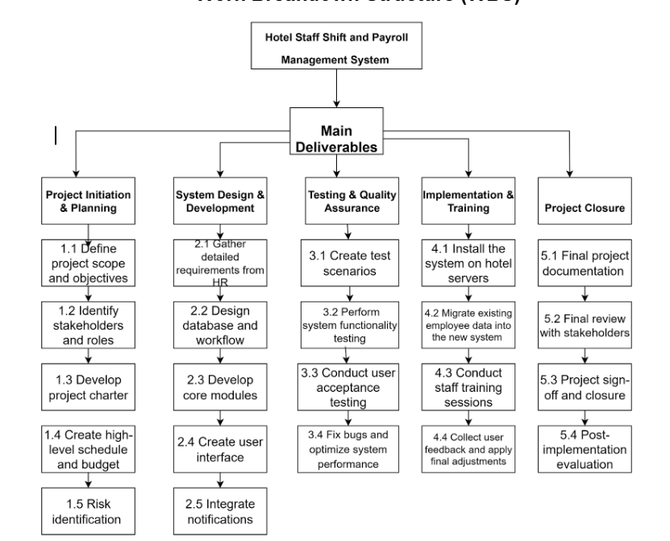
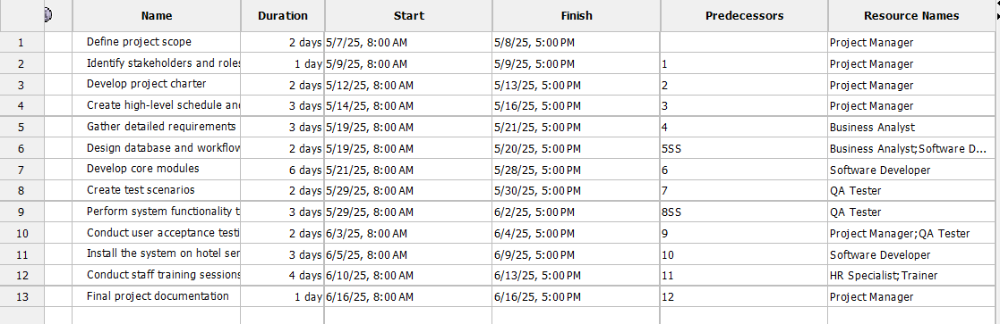

Αυτό το project αφορά την ανάπτυξη ενός συστήματος διαχείρισης βαρδιών και μισθοδοσίας προσωπικού ξενοδοχείου.  
Στόχος είναι η αυτοματοποίηση και βελτιστοποίηση των διαδικασιών διαχείρισης προσωπικού, με μείωση σφαλμάτων και εξοικονόμηση χρόνου.

---

### Πιστοποίηση

**Project Management Principles and Practices**  
από το University of California Irvine (UCI)

Η ειδίκευση αυτή περιλαμβάνει τα εξής 4 μαθήματα:

- Initiating and Planning Projects  
- Budgeting and Scheduling Projects  
- Managing Project Risks and Changes  
- Project Management Project

[Δες το επίσημο πιστοποιητικό μου στο Coursera](https://coursera.org/share/fd2d05339dc6f43fb27d33ae8e0cf200)
[Κατέβασε το πιστοποιητικό σε PDF](./Project_Management_Certification.pdf)

---

## Χρήση

Ανοίξτε το PDF για να δείτε την αναλυτική περιγραφή του project.

## Project Visuals

### Work Breakdown Structure (WBS)

### Gantt Chart

### Project Overview

