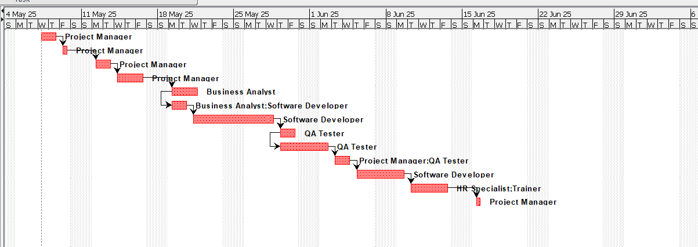

# Hotel Staff Shift and Payroll Management System

Αυτό το project αφορά την ανάπτυξη ενός συστήματος διαχείρισης βαρδιών και μισθοδοσίας προσωπικού ξενοδοχείου.  
Στόχος είναι η αυτοματοποίηση και βελτιστοποίηση των διαδικασιών διαχείρισης προσωπικού, με μείωση σφαλμάτων και εξοικονόμηση χρόνου.

---

## Πιστοποίηση

Αυτό το project υλοποιήθηκε στα πλαίσια της πιστοποίησης:

**Project Management Principles and Practices**  
από το University of California Irvine (UCI)

Το επίσημο πιστοποιητικό θα προστεθεί σε αυτό το αποθετήριο μόλις εκδοθεί.

---

## Περιεχόμενα

- Αρχείο PDF με το Project Management
- (Μελλοντικά) Πιστοποιητικό ολοκλήρωσης

---

## Χρήση

Ανοίξτε το PDF για να δείτε την αναλυτική περιγραφή του project.

## Project Visuals

### Work Breakdown Structure (WBS)

### Gantt Chart

### Project Overview

